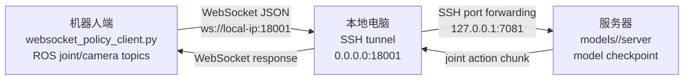

# Architecture

当前系统分为三端：服务器、本地电脑、机器人端。



## Request Flow

1. 机器人端读取左右臂 joint state。
2. 机器人端读取三路相机图像，并通过 `ws_policy_protocol.py` 编码。
3. 机器人端向本地电脑 `ws://<local-ip>:18001` 发送 WebSocket JSON request。
4. 本地电脑 SSH tunnel 把流量转发到服务器 `127.0.0.1:7081`。
5. 服务器端运行所选模型的 policy server，解码 request 并构造模型 observation。
6. OpenPI pi0.5 或 WAM/UVA-DiT policy 推理，返回 action chunk。
7. server 把 action tensor 转成 `left_arm` / `right_arm` chunk。
8. 机器人端 client 发布 joint action 到 ROS topic。

## Current Action Schema

```json
{
  "time_list": [0.1, 0.2, 0.3],
  "dt": 0.1,
  "left_arm": [[0.0, 0.0, 0.0, 0.0, 0.0, 0.0, 0.0]],
  "right_arm": [[0.0, 0.0, 0.0, 0.0, 0.0, 0.0, 0.0]]
}
```

当前 schema 是 joint action。EEF action 需要新增 schema、server 转换逻辑和机器人端 executor。

## Model Boundaries

```text
models/openpi_pi05/server  <->  models/openpi_pi05/client
models/uva_dit/server      <->  models/uva_dit/client
```

`docs/` 与 `reference/` 是公共资料。模型专属协议适配、启动器和机器人 client
必须保留在同一个模型目录内，不能跨模型组合运行。
